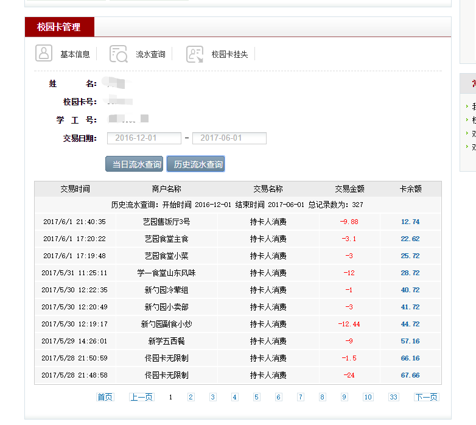
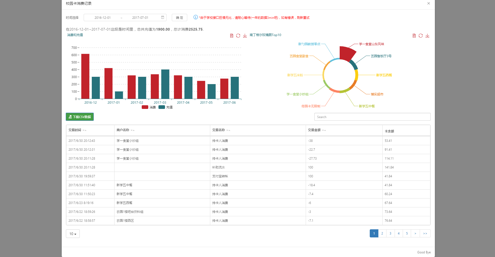

## 这是一个魔改的项目，旨在解决card.pku.edu.cn较为垃圾的交互

为了保证项目的轻量化，不搞后端服务器，不对用户数据进行存储。和pku-helper不同，本工具的使用需要PC端。

因此，本项目使用书签栏工具，在一定程度上保证了浏览器的可用性。

### 原来的交互

### 现在的交互

### 优点与缺点
优点:可以导出csv,可以进行可视化，可以简单排序，可以进行简单检索。

缺点：变慢了。

### 已毕业，该项目不再维护，抱歉。 
